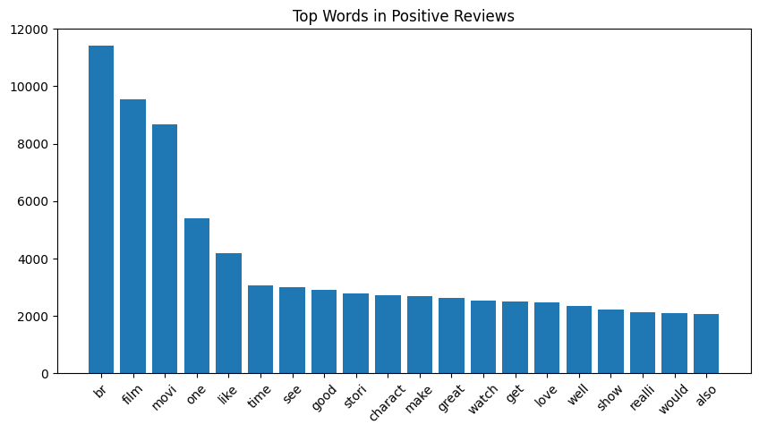
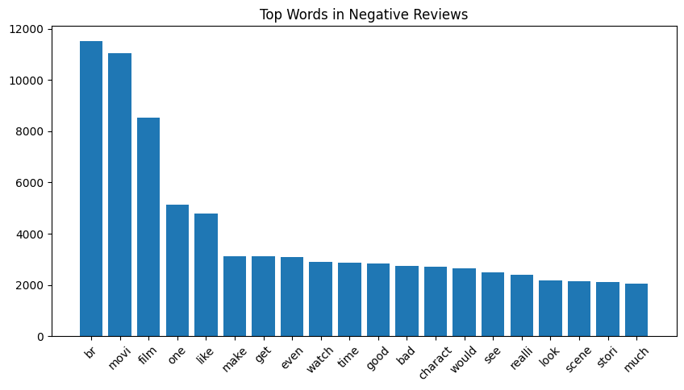
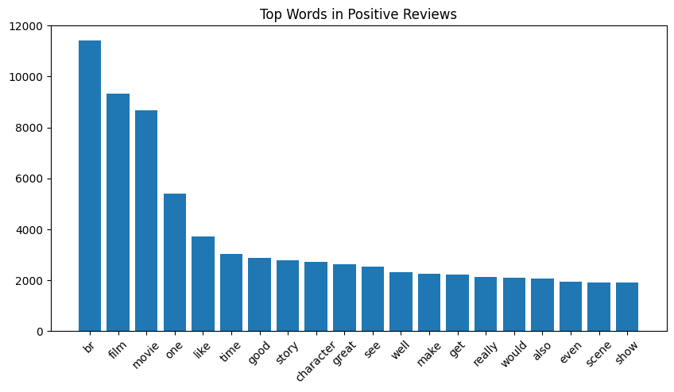
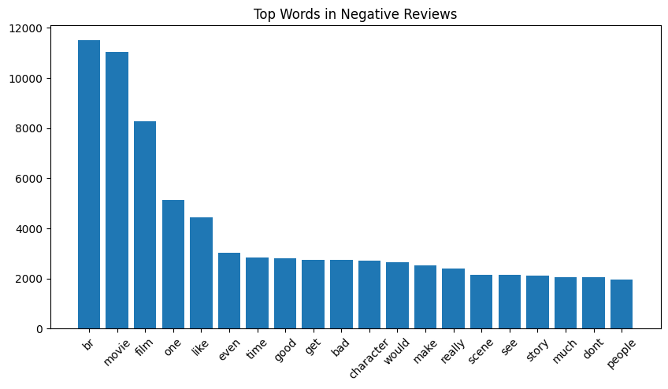

# Sentiment Model Training and Testing

## Dataset analysis:

The dataset comprises two columns: review and sentiment, where review contains textual data and sentiment represents the target label. 
The data has been pre-split into training and testing subsets. Notably, the test dataset is balanced to ensure fair evaluation metrics.

### Common Words Analysis

Test Data: An analysis of the test data has revealed the following most common words: 



Training Data: Similarly, the training data's most frequent words include: 



### Excluded Words
Certain words such as "br", "one", and "like" have been designated as common words in the settings.json file and are excluded from the analysis to prevent skewing the results due to their high frequency but low informational value. This approach helps in refining the feature set for more accurate sentiment analysis.


## Project structure:

This project has a modular structure, where each folder has a specific duty.

```
MLE_basic_example
├── data                      # Data files used for training and inference (it can be generated with data_loader.py script)
│   ├── raw
│   │   ├── test.csv
│   │   └── train.csv
│   └── processed
│       ├── count_vectors_stemmed_train.npz
│       ├── count_vectors_lemmatized_train.npz
│       ├── tfidf_vectors_stemmed_train.npz
│       ├── tfidf_vectors_lemmatized_train.npz
│       ├── count_vectors_stemmed_test.npz
│       ├── count_vectors_lemmatized_test.npz
│       ├── tfidf_vectors_stemmed_test.npz
│       └── tfidf_vectors_lemmatized_test.npz
├── data_process              # Scripts used for data processing and generation
│   ├── data_loader.py
│   └── __init__.py           
├── inference                 # Scripts and Dockerfiles used for inference
│   ├── Dockerfile
│   ├── run.py
│   └── __init__.py
├── models                    # Folder where trained models are stored
│   ├── Logistic Regression
│   │   ├── count_lemmatized_model.pkl
│   │   ├── count_stemmed_model.pkl
│   │   ├── tfidf_lemmatized_model.pkl
│   │   └── tfidf_stemmed_model.pkl
│   ├── SVC
│   │   ├── count_lemmatized_model.pkl
│   │   ├── count_stemmed_model.pkl
│   │   ├── tfidf_lemmatized_model.pkl
│   │   └── tfidf_stemmed_model.pkl
│   └── Random Forest
│   │   ├── count_lemmatized_model.pkl
│   │   ├── count_stemmed_model.pkl
│   │   ├── tfidf_lemmatized_model.pkl
│   │   └── tfidf_stemmed_model.pkl
├── training                  # Scripts and Dockerfiles used for training
│   ├── Dockerfile
│   ├── train.py
│   └── __init__.py
├── settings.json             # All configurable parameters and settings
└── README.md
```

## Settings:
The configurations for the project are managed using the `settings.json` file. It stores important variables that control the behaviour of the project. Examples could be the path to certain resource files, constant values, hyperparameters for an ML model, or specific settings for different environments. Before running the project, ensure that all the paths and parameters in `settings.json` are correctly defined.
Keep in mind that you may need to pass the path to your config to the scripts. For this, you may create a .env file or manually initialize an environment variable as `CONF_PATH=settings.json`.

## Data:
Data is the cornerstone of any Machine Learning project. For generating the data, use the script located at `data_process/data_loader.py`. The generated data is used to train the model and to test the inference. Following the approach of separating concerns, the responsibility of data generation lies with this script.

## Training:
The training phase of the ML pipeline includes preprocessing of data, the actual training of the model, and the evaluation and validation of the model's performance. All of these steps are performed by the script `training/train.py` which will be run automatically in scope of building the training Docker image.

1. To train the model using Docker: 

- Build the training Docker image. If the built is successfully done, it will automatically train the model:
```bash
docker build -f ./training/Dockerfile --build-arg settings_name=settings.json -t training_sentiment .
```
- Run the container with the following parameters to ensure that the trained model is here:
```bash
docker run -itd training_sentiment /bin/bash
```

`<container_id>` is first 12 digits of previous command output.
Another way to get the Docker container ID is to run 
```bash
docker ps
```

- Move the trained model from the directory inside the Docker container `/app/models` to the local machine using:
```bash
docker cp <container_id>:/app/models ./
```
- Move Inference data from `/app/data` to the local machine using:
```bash
docker cp <container_id>:/app/data ./
```
- Move the results from the directory inside the Docker container `/app/results` to the local machine using:
```bash
docker cp <container_id>:/app/results ./
```

1. Alternatively, the `data_loader.py` and `train.py` scripts can also be run locally as follows:

```bash
python3 data_process/data_loader.py
python3 training/train.py
```

## Inference:
Once a model has been trained, it can be used to make predictions on new data in the inference stage. The inference stage is implemented in `inference/run.py`.

1. To run the inference using Docker, use the following commands:

- Build the inference Docker image:
```bash
docker build -f ./inference/Dockerfile --build-arg settings_name=settings.json -t inference_sentiment .
```
- Run the inference Docker container with the attached terminal using the following command:
```bash
docker run -itd inference_sentiment /bin/bash  
```
`<container_id>` is first 12 digits of previous command output.
Another way to get the Docker container ID is to run 
```bash
docker ps
```
- Move the results from the directory inside the Docker container `/app/results` to the local machine using:
```bash
docker cp <container_id>:/app/results ./
```

2. Alternatively, you can also run the inference script locally:

```bash
python inference/run.py
```

## Script:
You may use script to run all previous steps in one command: 
```bash
./run_project.sh
```
Then Select mode of execution: [1] Docker, [2] Local.

## Wrap Up
This project illustrates a simple, yet effective template to organize an ML project. Following good practices and principles, it ensures a smooth transition from model development to deployment.